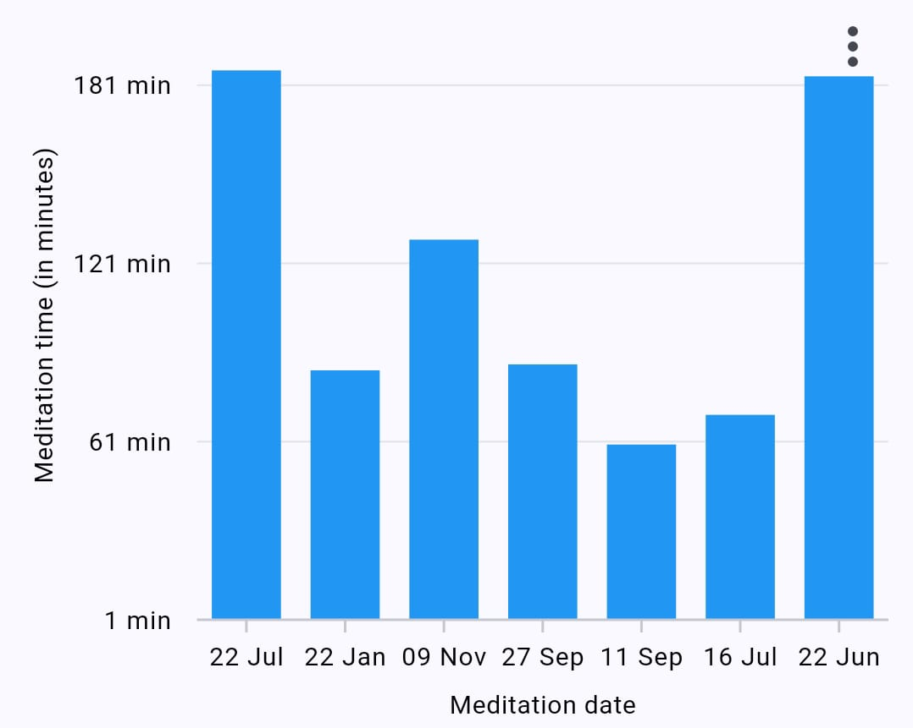

# Meditation graph


<figure><figcaption></figcaption></figure>

```dart
import 'package:menstrual_cycle_widget/menstrual_cycle_widget.dart';

class MenstrualCycleGraphExample extends StatelessWidget {
  @override
  Widget build(BuildContext context) {
    return Scaffold(
      appBar: AppBar(
        title: Text('Weight graph'),
      ),
      body: MenstrualMeditationGraph(
        isShowMoreOptions: true,
        onPdfDownloadCallback: (pdfPath) async {
          // This function will be called when the user downloads an pdf
          // pdfPath contains the path to the downloaded pdf
        },
        onImageDownloadCallback: (imagePath) async {
          // This function will be called when the user downloads an image
          // imagePath contains the path to the downloaded image
        },
      ),
    );
  }
}
```

## Parameter

<table><thead><tr><th width="198">Parameters</th><th width="129">Datatype</th><th width="269">Description</th><th>Default Value</th></tr></thead><tbody><tr><td><code>loadingText</code></td><td>String</td><td>Specify the loading text while fetch data from databse.</td><td>Loading...</td></tr><tr><td><code>isShowMoreOptions</code></td><td>bool</td><td>Specify as true to show download image and pdf options into right-top of graph.</td><td>false</td></tr><tr><td><code>onImageDownloadCallback</code></td><td>Function</td><td>Callback this function if user download image. It's return a path of the image.</td><td>-</td></tr><tr><td><code>onPdfDownloadCallback</code></td><td>Function</td><td>Callback this function if user download pdf. It's return a path of the image.</td><td>-</td></tr><tr><td><code>xAxisTitle</code></td><td>String</td><td>Specify the title of xAxis</td><td>Cycle start date</td></tr><tr><td><code>xAxisTitleTextStyle</code></td><td>TextStyle</td><td>Specify the text style of xAxis</td><td>TextStyle(color: Colors.black, fontSize: 10)</td></tr><tr><td><code>isShowXAxisTitle</code></td><td>bool</td><td>Speficy false if want to hide xAxis title </td><td>true</td></tr><tr><td><code>yAxisTitle</code></td><td>String</td><td>Specify the title of yAxis</td><td>Cycle length (in days)</td></tr><tr><td><code>yAxisTitleTextStyle</code></td><td>TextStyle</td><td>Specify the text style of yAxis</td><td>TextStyle(color: Colors.black, fontSize: 10)</td></tr><tr><td><code>isShowYAxisTitle</code></td><td>bool</td><td>Speficy false if want to hide yAxis title </td><td>true</td></tr><tr><td><code>tooltipBackgroundColor</code></td><td>Color</td><td>Specify the color of tooltip backgound</td><td>Colors.black</td></tr><tr><td><code>graphColor</code></td><td>Color</td><td>Specify the color of graph</td><td>Colors.blue</td></tr></tbody></table>
